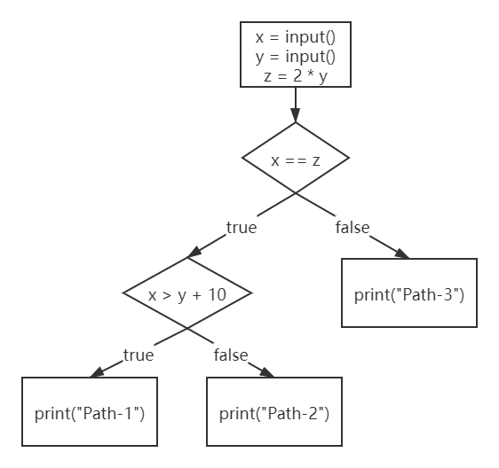
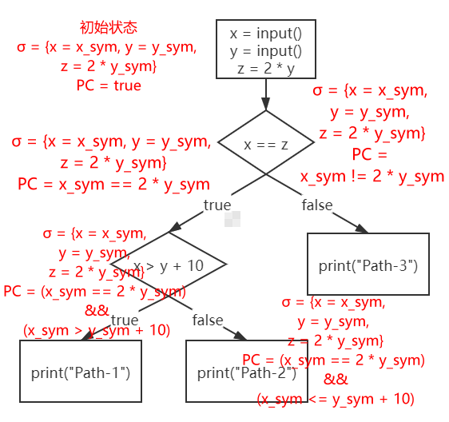

angr是一个多架构的二进制分析工具包，能够对二进制文件执行动态符号执行和各种静态分析，当然主要的功能还是进行符号执行。

符号执行是angr的基石，可以说如果不能充分理解angr背后的符号执行原理就很难灵活使用angr，所以angr这部分我们从符号执行原理讲起。

### 0x00. 参考资料

- [Symbolic Execution for Software Testing Three Decades Later](attachment/Symbolic%20Execution%20for%20Software%20Testing%20Three%20Decades%20Later.pdf) 一篇简短且通俗易懂的论文，没有很多抽象的定义，适合入门学习
- [符号执行入门](https://zhuanlan.zhihu.com/p/26927127) 基本上是上面那篇论文的翻译，适合与原文对照学习

### 0x01. 什么是符号执行

一般情况下，当我们运行一个程序并**给定程序所需要的所有输入**时，一个程序的执行路径是**确定**并且**唯一**的，这里用一个伪代码来说明：

```cpp
int main(){
    x = input();
    y = input();
    z = 2 * y;
    if(x == z){
        if(x > y + 10){
            print("Path-1");
        }else{
            print("Path-2");
        }
    }else{
        print("Path-3");
    }
}
```

input函数表示获取用户输入，print函数就是字面意思，我们可以很容易地画出程序的控制流程图（Control Flow Graph）：



假设用户的输入是{x = 2, y = 1}，那么程序会沿着红色线条标记的路径执行，其路径是确定且唯一的，其他输入也同理，这里不再赘述。当程序的输入确定时，这种执行就叫做*具体执行*：


如果现在input函数不是获取用户的具体输入，而是直接获取一个对应的*符号值*呢？例如{x = x<sub>sym</sub>, y = y<sub>sym</sub>}。当程序的输入由具体的值变成了符号值之后，程序的运行由具体执行变成了*符号执行（Symbolic Execution）*。

为了解释符号执行，现在我要引入两个概念，第一个概念叫做*符号状态（Symbolic State）*，并且用σ来表示，符号状态是原变量到符号值的一个映射，初始时符号状态σ为空，当执行完以下两个语句后：

```cpp
x = input();
y = input();
```

即x和y获得了符号化的输入{x = x<sub>sym</sub>, y = y<sub>sym</sub>}，此时的符号状态σ = {x → x<sub>sym</sub>, y → y<sub>sym</sub>}。当执行完`z = 2 * y`之后，符号状态更新为σ = {x → x<sub>sym</sub>>, y → y<sub>sym</sub>, z → 2 * y<sub>sym</sub>}。

第二个概念叫做*路径约束（Path Constraint）*，简称PC，PC表示到达当前路径需要满足的条件，PC的初始值为true，意为没有约束。例如达到Path-1需要满足条件`x == z`和`x > y + 10`，那么这条路径的路径约束PC就是(x<sub>sym</sub> == 2 * y<sub>sym</sub>) && (x<sub>sym</sub> > y<sub>sym</sub> + 10)。

符号执行需要为每一条路径维护一个符号状态σ和一个路径约束PC，让我们来模拟一下上述实例程序的符号执行过程，首先是初始状态，符号状态σ映射了x, y和z的符号值，此时路径约束PC = true：


假设符号执行的遍历策略是广度优先搜索BFS，那么经过第一个分支之后，符号执行分裂出了两条路径，两条路径的状态分别是：


分裂出来的两个路径唯一的不用是路径约束PC不同，不同的原因是因为分支条件的成立与否不同。分支条件成立就会执行左边的路径，PC = x_sym == 2 * y_sym表示达到左边的路径需要满足的约束条件；分支条件不成立就会执行右边的路径，PC = x_sym != 2 * y_sym表示达到右边的路径需要满足的约束条件。

右边这条路径已经执行到尽头了，而左边的路径还可以继续延伸，所以继续分裂出两条路径，更新路径约束PC：



所以该程序执行到最后有3个状态，对应3条不同的路径。讲到这里，相信大家对符号执行已经有一个初步的认识了，接下来我们进行下一步的学习。

### 0x02. 约束求解

假设现在有一个问题——我们输入的x和y的值分别是多少时，程序能够输出"Path-1"。在上一节中我们已经通过符号执行求解出了Path-1对应的路径约束PC，即PC = (x<sub>sym</sub> == 2 * y<sub>sym</sub>) && (x<sub>sym</sub> > y<sub>sym</sub> + 10)，那么我们只需要把x<sub>sym</sub>和y<sub>sym</sub>当做未知量，令PC == true，即可得到一个二元一次方程：(x<sub>sym</sub> == 2 * y<sub>sym</sub>) && (x<sub>sym</sub> > y<sub>sym</sub> + 10) == true，对这个方程求解即可得到一系列满足条件的x和y。

目前流行的符号执行引擎基本都会内置一个约束求解器（通俗点来说就是方程/方程组求解器），angr和miasm两个符号执行引擎使用的约束求解器都是z3，z3是微软开发的一款开源约束求解器，功能强大并且易用，之后我们会对z3专门进行讲解。简单用z3演示一下上述路径约束的求解：

```python
from z3 import *

x = Int('x')
y = Int('y')
solver = Solver()
solver.add(x == 2 * y)
solver.add(x > y + 10)
print(solver.check())
print(solver.model())
```

输出：

```
sat
[y = 11, x = 22]
```

solver.check()用来检验方程是否有解，sat表示方程有解，unsat表示方程无解。[y = 11, x = 22]是求解出来方程的一个可行解。

除了用来求解具体值之外，约束求解也可以用来判断某条路径是否可行，如果一条路径的约束求解无解，则该条路径总是不会被执行，其后的分支也可以被忽略，节省符号执行的时间。

约束求解在某种程度上依然是符号执行的关键瓶颈之一，也就是说符号执行所需求的约束求解能力超出了当前约束求解器的能力。很多时候符号执行引擎跑不出结果来都是因为约束求解能力不足，这一点我们会在之后讨论。符号执行的入门知识讲到这就足够了，之后我们会在合适的时机进行拓展。

