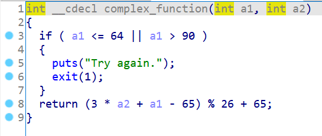
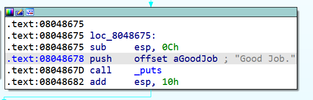
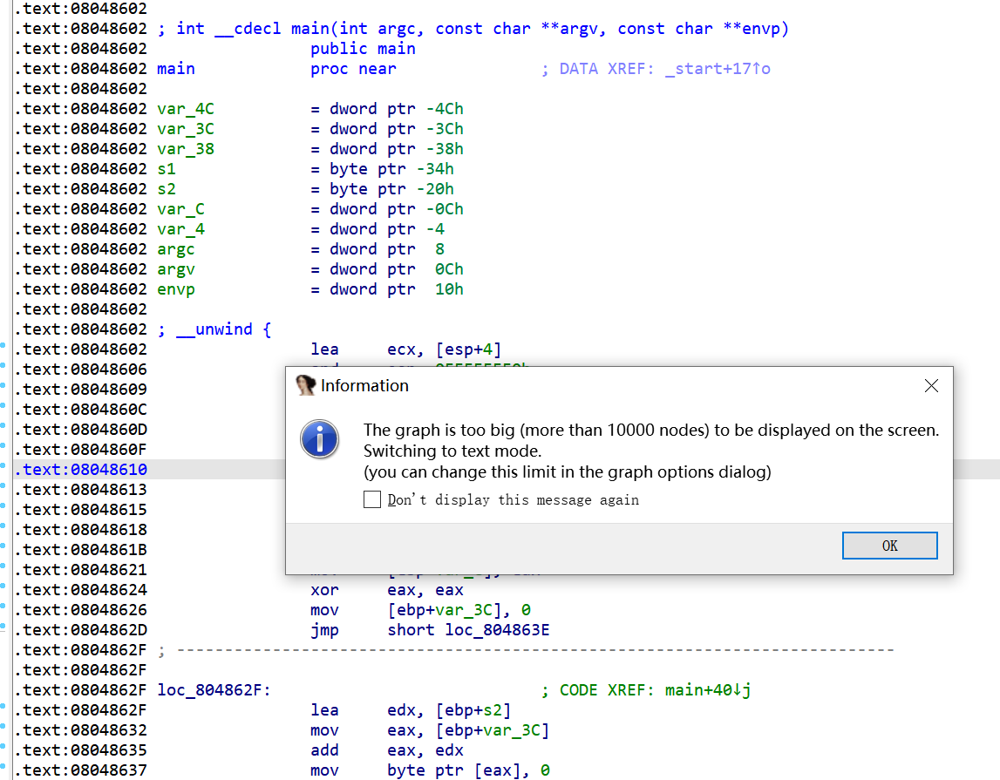
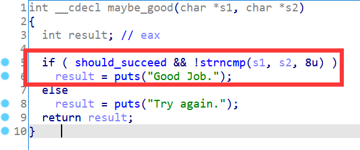

从这一节开始我们将通过一些CTF的范例来讲解angr的用法，本节中使用的程序来自GitHub上的[angr_ctf](https://github.com/jakespringer/angr_ctf)仓库，建议读者不要光看，还要跟着练习一下。首先来讲讲explore函数的简单用法，这也是angr中最简单粗暴的一个函数。

## 00_angr_find

一个非常简单的题目，这点计算量直接手动分析也很简单：




因为程序流程非常简单，运算量也比较小，可以直接用最简单粗暴的explore：



```python
import angr

proj = angr.Project('dist/00_angr_find')
state = proj.factory.entry_state()
simgr = proj.factory.simgr(state)
simgr.explore(find=0x8048678)
print(simgr.found[0].posix.dumps(0))
```

输出：

```python
b'JXWVXRKX'
```

## 01_angr_avoid

这题的main函数非常庞大导致无法反编译，也无法手动分析程序流程：



但我们仍然可以通过分析关键代码来了解部分程序逻辑，显然只有`should_succeed`为true时才能输出"Good Job."，所以avoid_me这个函数肯定是不能被执行的：




所以我们可以在给explore函数传递find参数的同时再传递一个avoid参数，让符号执行引擎避开avoid_me这个函数，代码如下：

```python
import angr

proj = angr.Project('dist/01_angr_avoid')
state = proj.factory.entry_state()
simgr = proj.factory.simgr(state)
simgr.explore(find=0x80485E0, avoid=0x80485A8)
print(simgr.found[0].posix.dumps(0))
```

输出：

```python
b'HUJOZMYS'
```

不加avoid参数也能跑出结果，不过速度会慢很多，这就是explore函数的第二个用法。

## 02_angr_find_condition

这题的控制流图（CFG）非常复杂，但是查看伪代码却很简单，推测是有大量功能相同的重复代码块，在IDA生成伪代码的时候被优化了：


因为有很多重复代码块，所以这题也有很多可能会输出"Good Job."的地址，这时候我们像`00_angr_find`那样设定一个单一的目标地址就不太可能了。不过幸好，explore函数的find参数除了地址外，也可以是一个携带SimState参数的函数，代码如下：

```python
import angr

def is_successful(state):
    return b'Good Job.' in state.posix.dumps(1)

def should_avoid(state):
    return b'Try again.' in state.posix.dumps(1)

proj = angr.Project('dist/02_angr_find_condition')
state = proj.factory.entry_state()
simgr = proj.factory.simgr(state)
simgr.explore(find=is_successful, avoid=should_avoid)
print(simgr.found[0].posix.dumps(0))
```

输出：

```python
b'HETOBRCU'
```

这里通过is_successful函数判断当前状态的输出流中是否包含b'Good Job.'，如果包含则表示到达目的地址，ok，此时可以打印对应的输入了。should_avoid函数同理，这里不再赘述。

除了传入一个函数以外，我们也可以使用lambda表达式来简化代码：

```python
import angr

proj = angr.Project('dist/02_angr_find_condition')
state = proj.factory.entry_state()
simgr = proj.factory.simgr(state)
# simgr.explore(find=is_successful, avoid=should_avoid)
simgr.explore(
    find=lambda state : b'Good Job.' in state.posix.dumps(1),
    avoid=lambda state: b'Try again.' in state.posix.dumps(1)
)
print(simgr.found[0].posix.dumps(0))
```

什么是lambda表达式，大家可以自行学习，这里就不多说了。