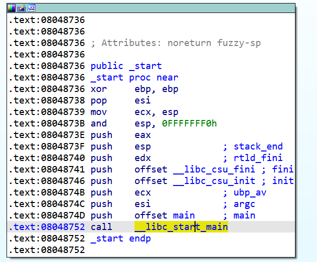
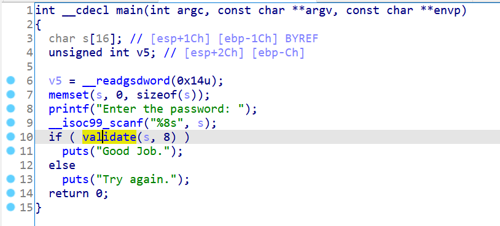

在05_angr_hooks中我提出了一个猜测：angr会根据导入表自动识别**动态链接**的库函数并进行替换。如果是静态链接的库函数angr能不能识别呢？接下来我们通过两个例子来验证。

## 13_angr_static_binary

第一个例子是一个静态链接的程序，逻辑跟00_angr_find基本一致：


再用00_angr_find的脚本跑一下试试：

```python
import angr

proj = angr.Project('../dist/13_angr_static_binary')
state = proj.factory.entry_state()
simgr = proj.factory.simgr(state)
simgr.explore(
    find=lambda state : b'Good Job.' in state.posix.dumps(1),
    avoid=lambda state: b'Try again.' in state.posix.dumps(1)
)
print(simgr.found[0].posix.dumps(0))
```

发现根本跑不出来，所以angr在这里是没有成功识别库函数并替换的，需要我们手动替换，防止angr符号执行陷进复杂的库函数里面：

```python
proj.hook_symbol('printf', angr.SIM_PROCEDURES['libc']['printf']())
proj.hook_symbol('__isoc99_scanf',angr.SIM_PROCEDURES['libc']['scanf']())
proj.hook_symbol('strcmp', angr.SIM_PROCEDURES['libc']['strcmp']())
proj.hook_symbol('puts', angr.SIM_PROCEDURES['libc']['puts']())
proj.hook_symbol('__libc_start_main',angr.SIM_PROCEDURES['glibc']['__libc_start_main']())
```

完整代码：

```python
import angr

proj = angr.Project('../dist/13_angr_static_binary')

proj.hook_symbol('printf', angr.SIM_PROCEDURES['libc']['printf']())
proj.hook_symbol('__isoc99_scanf',angr.SIM_PROCEDURES['libc']['scanf']())
proj.hook_symbol('strcmp', angr.SIM_PROCEDURES['libc']['strcmp']())
proj.hook_symbol('puts', angr.SIM_PROCEDURES['libc']['puts']())
proj.hook_symbol('__libc_start_main',angr.SIM_PROCEDURES['glibc']['__libc_start_main']())
state = proj.factory.entry_state()
simgr = proj.factory.simgr(state)
simgr.explore(
    find=lambda state : b'Good Job.' in state.posix.dumps(1),
    avoid=lambda state: b'Try again.' in state.posix.dumps(1)
)
print(simgr.found[0].posix.dumps(0))
```

输出：

```python
b'PNMXNMUD'
```

`__libc_start_main`函数会在入口函数`_start`里被调用，主要是完成一些程序的初始化操作以及main函数的调用，这个函数也把它hook掉：




## 14_angr_shared_library

接下来我们通过这题来了解如何对动态链接库中单个的函数进行符号执行，main函数的代码如下：



其中validate函数是动态链接库lib14_angr_shared_library.so的函数：


我们可以直接通过call_state创建一个函数调用的初始状态：

```python
state = proj.factory.call_state(validate_addr, password, length)
```

完整代码如下：

```python
import angr
import claripy

proj = angr.Project('../dist/lib14_angr_shared_library.so')

validate_addr = 0x4006D7
password = claripy.BVS('password', 8 * 8)
length = claripy.BVV(8, 32)
state = proj.factory.call_state(validate_addr, password, length)
simgr = proj.factory.simgr(state)
simgr.explore(find=0x400783)
found = simgr.found[0]
found.solver.add(found.regs.eax == 1)
print(found.solver.eval(password, cast_to=bytes))
```

输出：

```python
b'PGXSNWTS'
```

动态链接库都是地址无关的可执行文件（position-independent executable，PIE），若不手动指定PIE的基质，angr会将符号执行的基址指定为默认的0x400000，并输出：

```
WARNING | 2021-10-07 00:15:28,674 | cle.loader | The main binary is a position-independent executable. It is being loaded with a base address of 0x400000.
```

当然也可以自行指定基址，方法如下：

```python
proj = angr.Project('../dist/lib14_angr_shared_library.so', load_options={
    'main_opts' : {
        'base_addr' : 0x400000
    }
})
```

