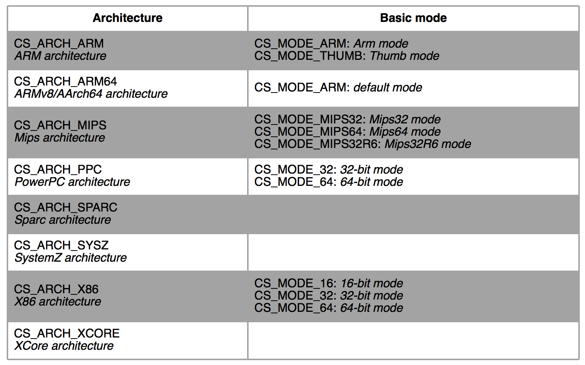

Capstone是一个轻量级的多平台、多架构的反汇编框架。简单来说，Capstone的功能就是将字节码转化为对应的汇编指令。Capstone目前支持的反汇编架构有：Arm, Arm64 (Armv8), Mips, X86 (include X86_64)等等。

## 0x00. 安装

Capstone基于C语言实现，同时封装了多种编程语言的版本，以Python版为例：

```shell
$ sudo pip install capstone
```

在Windows或root权限下：

```shell
$ pip install capstone
```

其他版本的安装方法可以参考[官方文档](http://www.capstone-engine.org/documentation.html)。

## 0x01. 基本用法

Capstone的API非常简单，以下是一个将字节码反汇编成64位x86汇编指令的例子：

```python
from capstone import *

CODE = b"\x55\x48\x8b\x05\xb8\x13\x00\x00"

md = Cs(CS_ARCH_X86, CS_MODE_64)
for i in md.disasm(CODE, 0x1000):
    print("0x%x:\t%s\t%s" %(i.address, i.mnemonic, i.op_str))
```

输出：

```assembly
0x1000: push    rbp
0x1001: mov     rax, qword ptr [rip + 0x13b8]
```

for循环中i的类型为`<class 'capstone.CsInsn'>`，是一条汇编指令的封装。有时我们只关心汇编指令中的地址、助记符（mnemonic）、操作数等，可以使用更简单的写法：

```python
from capstone import *

CODE = b"\x55\x48\x8b\x05\xb8\x13\x00\x00"

md = Cs(CS_ARCH_X86, CS_MODE_64)
for (address, size, mnemonic, op_str) in md.disasm_lite(CODE, 0x1000):
	print("0x%x:\t%s\t%s" %(address, mnemonic, op_str))
```

输出：

```assembly
0x1000: push    rbp
0x1001: mov     rax, qword ptr [rip + 0x13b8]
```

## 0x02. 架构和模式

目前，Capstone支持8中硬件架构的反汇编，对应的模式如下：



另外有一些模式可以跟以上的基本模式混合使用：


不同的模式可以通过`+`操作符连接，以下是一个Mips64和小端模式混合使用的例子：

```python
from capstone import *

CODE = b"\x56\x34\x21\x34\xc2\x17\x01\x00"

md = Cs(CS_ARCH_MIPS, CS_MODE_MIPS64 + CS_MODE_LITTLE_ENDIAN)
for i in md.disasm(CODE, 0x1000):
	print("%x:\t%s\t%s" %(i.address, i.mnemonic, i.op_str))
```

## 0x03. 更多用法

Capstone还有一些不太常用的用法，感兴趣的读者可以参考[官方文档](http://www.capstone-engine.org/lang_python.html)，这里不再讲解。
