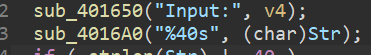
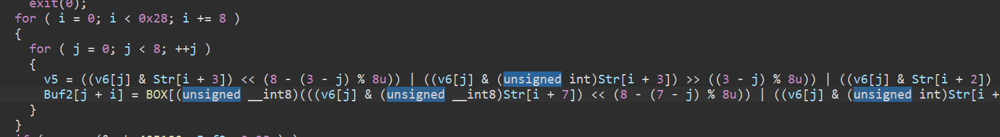

Z3是微软开发的一款约束求解器，在CTF中我们通常使用Z3来求解复杂的线性方程组或者代替人工来求解复杂的加密算法。

## 0x00. 安装

pip一键安装：

```shell
$ pip install z3-solver
```

z3也支持了很多其他编程语言，如C#、C/C++、Java等，安装方法请参考[官方GitHub项目](https://github.com/Z3Prover/z3)。

## 0x01. 基本用法

使用z3进行求解大致可以分为以下几个步骤：

1. 创建变量（未知数）
2. 添加约束（方程）
3. 检查方程/方程组是否有解
4. 约束求解

### 创建变量

方程中存在未知数，我们创建方程的目的就是对这些未知数进行求解。z3支持多种变量类型，最常用的是`整数`和`实数`两个类型，创建方法如下：

```python
>>> from z3 import *
>>> x = Int('x')		# 创建一个名为x的整形变量
>>> y = Real('y')		# 创建一个名为y的实数变量
```

其中`x`和`y`的类型都为`ArithRef`，即与整数或实数有关的算数表达式：

```python
>>> type(x)
<class 'z3.z3.ArithRef'>
>>> type(y)
<class 'z3.z3.ArithRef'>
```

也可以使用如下方法创建多个变量：

```python
>>> X = Ints('x1 x2 x3 x4')
>>> Y = Reals('y1 y2 y3 y4')
>>> X
[x1, x2, x3, x4]
>>> Y
[y1, y2, y3, y4]
```

还可以使用[列表生成式](https://www.liaoxuefeng.com/wiki/1016959663602400/1017317609699776)批量创建变量：

```python
>>> X = [Int('x%d' % i) for i in range(20)]
>>> X
[x0, x1, x2, x3, x4, x5, x6, x7, x8, x9, x10, x11, x12, x13, x14, x15, x16, x17, x18, x19]
```

### 添加约束

方程组由若干个方程（也叫作约束）组成，在z3中想要添加约束首先得创建一个**求解器**：

```python
>>> s = Solver()
>>> type(s)
<class 'z3.z3.Solver'>
```

初始时求解器`s`并没有任何约束，此时是一个无约束状态：

```python
>>> s
[]
```

接下来演示一下用z3创建一个三元一次方程的写法。首先创建3个变量 `x, y, z`，并创建约束求解器`s `：

```python
>>> from z3 import *

>>> x, y, z = Ints('x y z')
>>> s = Solver()
```

使用求解器`s`的`add`方法添加约束：

```python
>>> s.add(2 * x + 3 * y + z == 6)
>>> s.add(x - y + 2 * z == -1)
>>> s.add(x + 2 * y - z == 5)
>>> s
[2*x + 3*y + z == 6, x - y + 2*z == -1, x + 2*y - z == 5]
```

等价于创建了一个三元一次方程组：
$$
\begin{cases}
2x+3y+z=6\\
x-y+2z=-1\\
x+2y-z=5
\end{cases}
$$

### 检查方程/方程组是否有解

在进行求解之前需要先检查方程/方程组是否有解，Solver提供了`check`方法来完成这一操作。check的结果有sat（有解）、unsat（无解）、unknown（未知）三种，只有当check有解时才能进行求解：

```python
>>> x = Int('x')
>>> s = Solver()
>>> s.check()
sat
>>> s.add(x > 0, x < 2)
>>> s.check()
sat
>>> s.model().eval(x)
1
>>> s.add(x < 1)
>>> s.check()
unsat
>>> s.reset()
>>> s.add(2**x == 4)
>>> s.check()
unknown
```

### 约束求解

check为sat之后我们可以调用Solver的`model`方法进行求解：

```python
if s.check() == sat:
    print(s.model())
else:
    print('unsat')
```

上述线性方程组的求解结果如下：

```python
[z = -1, y = 1, x = 2]
```

如果我们只关心其中的一个变量的解还可以这样写：

```python
>>> mod = s.model()
>>> mod.eval(x).as_long()
2
```

或者：

```python
mod[x].as_long()
```

接下来通过一些例题加深对z3的理解。

## 0x02. 例题1-[西湖论剑2021]ROR

这是一道比较简单的题，首先程序读取输入到Str，长度为40个字节：



接下来将输入字符串进行了一段非常复杂的加密：



加密后与密文进行比较：


这段加密非常复杂，手动求解会浪费很多时间，因此可以考虑使用z3自动求解。完整exp如下：

```python
from z3 import *

BOX = [0x65, 0x08, 0xF7, 0x12, 0xBC, 0xC3, 0xCF, 0xB8, 0x83, 0x7B, 0x02, 0xD5, 0x34, 0xBD, 0x9F, 0x33, 0x77, 0x76, 0xD4, 0xD7, 0xEB, 0x90, 0x89, 0x5E, 0x54, 0x01, 0x7D, 0xF4, 0x11, 0xFF, 0x99, 0x49, 0xAD, 0x57, 0x46, 0x67, 0x2A, 0x9D, 0x7F, 0xD2, 0xE1, 0x21, 0x8B, 0x1D, 0x5A, 0x91, 0x38, 0x94, 0xF9, 0x0C, 0x00, 0xCA, 0xE8, 0xCB, 0x5F, 0x19, 0xF6, 0xF0, 0x3C, 0xDE, 0xDA, 0xEA, 0x9C, 0x14, 0x75, 0xA4, 0x0D, 0x25, 0x58, 0xFC, 0x44, 0x86, 0x05, 0x6B, 0x43, 0x9A, 0x6D, 0xD1, 0x63, 0x98, 0x68, 0x2D, 0x52, 0x3D, 0xDD, 0x88, 0xD6, 0xD0, 0xA2, 0xED, 0xA5, 0x3B, 0x45, 0x3E, 0xF2, 0x22, 0x06, 0xF3, 0x1A, 0xA8, 0x09, 0xDC, 0x7C, 0x4B, 0x5C, 0x1E, 0xA1, 0xB0, 0x71, 0x04, 0xE2, 0x9B, 0xB7, 0x10, 0x4E, 0x16, 0x23, 0x82, 0x56, 0xD8, 0x61, 0xB4, 0x24, 0x7E, 0x87, 0xF8, 0x0A, 0x13, 0xE3, 0xE4, 0xE6, 0x1C, 0x35, 0x2C, 0xB1, 0xEC, 0x93, 0x66, 0x03, 0xA9, 0x95, 0xBB, 0xD3, 0x51, 0x39, 0xE7, 0xC9, 0xCE, 0x29, 0x72, 0x47, 0x6C, 0x70, 0x15, 0xDF, 0xD9, 0x17, 0x74, 0x3F, 0x62, 0xCD, 0x41, 0x07, 0x73, 0x53, 0x85, 0x31, 0x8A, 0x30, 0xAA, 0xAC, 0x2E, 0xA3, 0x50, 0x7A, 0xB5, 0x8E, 0x69, 0x1F, 0x6A, 0x97, 0x55, 0x3A, 0xB2, 0x59, 0xAB, 0xE0, 0x28, 0xC0, 0xB3, 0xBE, 0xCC, 0xC6, 0x2B, 0x5B, 0x92, 0xEE, 0x60, 0x20, 0x84, 0x4D, 0x0F, 0x26, 0x4A, 0x48, 0x0B, 0x36, 0x80, 0x5D, 0x6F, 0x4C, 0xB9, 0x81, 0x96, 0x32, 0xFD, 0x40, 0x8D, 0x27, 0xC1, 0x78, 0x4F, 0x79, 0xC8, 0x0E, 0x8C, 0xE5, 0x9E, 0xAE, 0xBF, 0xEF, 0x42, 0xC5, 0xAF, 0xA0, 0xC2, 0xFA, 0xC7, 0xB6, 0xDB, 0x18, 0xC4, 0xA6, 0xFE, 0xE9, 0xF5, 0x6E, 0x64, 0x2F, 0xF1, 0x1B, 0xFB, 0xBA, 0xA7, 0x37, 0x8F]
REV_BOX = [0] * 256
for i in range(256):
    REV_BOX[BOX[i]] = i
KEY = [128, 64, 32, 16, 8, 4, 2, 1]
ENC = [0x65, 0x55, 0x24, 0x36, 0x9D, 0x71, 0xB8, 0xC8, 0x65, 0xFB, 0x87, 0x7F, 0x9A, 0x9C, 0xB1, 0xDF, 0x65, 0x8F, 0x9D, 0x39, 0x8F, 0x11, 0xF6, 0x8E, 0x65, 0x42, 0xDA, 0xB4, 0x8C, 0x39, 0xFB, 0x99, 0x65, 0x48, 0x6A, 0xCA, 0x63, 0xE7, 0xA4, 0x79]
flag = [BitVec('x%d' % i, 8) for i in range(40)]
s = Solver()
for i in range(0, 40, 8):
    for j in range(8):
        v5 = ((KEY[j] & flag[i + 3]) << (8 - (3 - j) % 8)) | ((KEY[j] & flag[i + 3]) >> ((3 - j) % 8)) | ((KEY[j] & flag[i + 2]) << (8 - (2 - j) % 8)) | ((KEY[j] & flag[i + 2]) >> ((2 - j) % 8)) | ((KEY[j] & flag[i + 1]) << (8 - (1 - j) % 8)) | ((KEY[j] & flag[i + 1]) >> ((1 - j) % 8)) | ((KEY[j] & flag[i]) << (8 - -j % 8)) | ((KEY[j] & flag[i]) >> (-j % 8))
        s.add(REV_BOX[ENC[j + i]] == (((KEY[j] & flag[i + 7]) << (8 - (7 - j) % 8)) | ((KEY[j] & flag[i + 7]) >> ((7 - j) % 8)) | ((KEY[j] & flag[i + 6]) << (8 - (6 - j) % 8)) | ((KEY[j] & flag[i + 6]) >> ((6 - j) % 8)) | ((KEY[j] & flag[i + 5]) << (8 - (5 - j) % 8)) | ((KEY[j] & flag[i + 5]) >> ((5 - j) % 8)) | ((KEY[j] & flag[i + 4]) << (8 - (4 - j) % 8)) | ((KEY[j] & flag[i + 4]) >> ((4 - j) % 8)) | v5))
print(s.check())
mod = s.model()
print(''.join([chr(mod[x].as_long()) for x in flag]))
```

输出：

```
sat
Q5la5_3KChtem6_HYHk_NlHhNZz73aCZeK05II96
```

其中有几个要注意的地方，第一个是：

```python
flag = [BitVec('x%d' % i, 8) for i in range(40)]
```

注意这里创建的类型是`BitVec`而不是之前提到过的`Int`或`Real`，因为`Int`和`Real`都不能进行按位运算，如异或、左移、右移等等。`BitVec('x%d' % i, 8)`表示创建一个大小为8 bit，名称为`xi`的比特向量。

第二个地方是：

```python
s.add(REV_BOX[ENC[j + i]] == ...)
```

这里不能写成：

```python
s.add(ENC[j + i] == BOX[...])
```

因为列表的索引号只能为整数或者slice，不能为`ArithRef`，即一个算数表达式，所以我们对BOX求了逆得到REV_BOX，再构造方程。

方程部分直接复制IDA反编译的结果再稍微修改一下即可。

